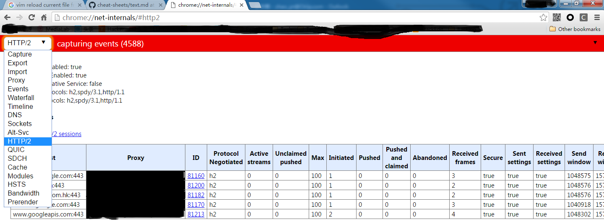

Google Chrome Browser
====================

1. net internals

  Type the following URL in chrome to get some details of network information:

  ```shell
  chrome://net-internals/
  ```

  For example, `chrome://net-internals/#http2` returns this page:
  
